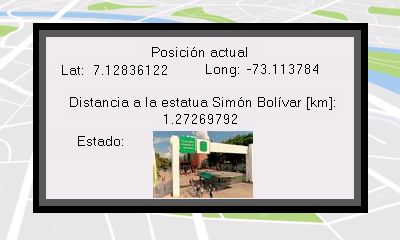

# PICTracker

Este proyecto consiste en la programación de un microcontrolador PIC16F1827 para realizar un monitoreo de posición utilizando un módulo GPS. El microcontrolador genera una alerta cuando se encuentra fuera de un perímetro permitido de 5 km y muestra dicha alerta en una pantalla Nextion.

La dificultad de este proyecto radica en la programación del microcontrolador, ya que se debe usar un microcontrolador de tamaño reducido y con poca memoria. El microcontrolador debe ser capaz de leer los datos del módulo GPS, calcular la distancia usando la fórmula de Haversine, y mostrar la alerta en la pantalla Nextion.

## Captura de pantalla

## Licencia

Este proyecto está bajo la licencia [MIT](LICENSE).